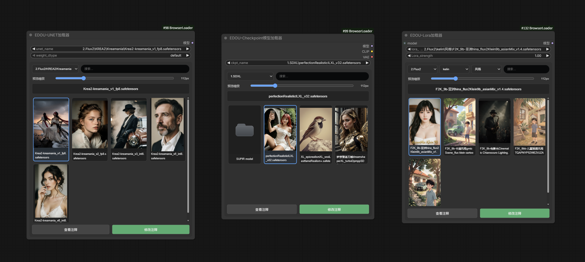
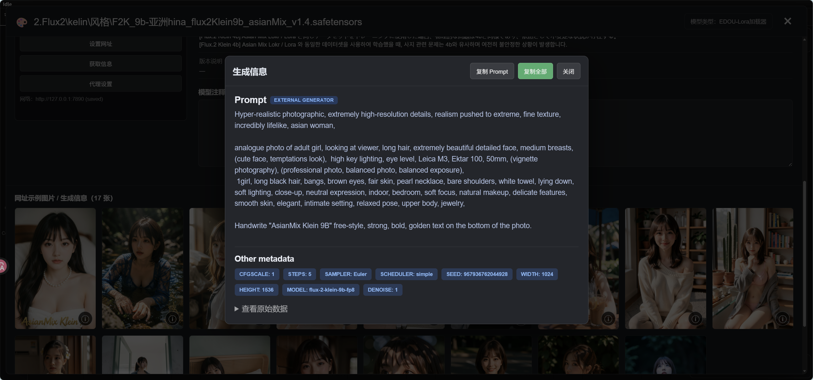

# ComfyUI-BrowserLoader

为Comfy UI打造的图片加载、模型加载易用节点包，可以方便查看图片和模型。

当前版本：**v1

EDOU 的 ComfyUI 浏览式加载节点包，包含 4 个节点：

- **EDOU图像浏览加载**：文件管理器式浏览 `ComfyUI/input`，完整缩略图、上下滚动、上传、拖拽上传、MaskEditor、预览缩放。
- **EDOU-UNET加载器**：UNET / diffusion_models 封面浏览加载，2:3 完整封面、文件管理器式当前层级浏览、搜索、预览缩放。
- **EDOU-Checkpoint模型加载器**：Checkpoint 封面浏览加载，2:3 完整封面、文件管理器式当前层级浏览、搜索、预览缩放。
- **EDOU-Lora加载器**：仅模型 LoRA 加载器，三级目录过滤、文件夹卡片、2:3 完整封面、预览缩放；强度输入显示为 `Lora_strength`。
## 节点预览






## 安装

1. 关闭 ComfyUI。
2. 下载 解压 `ComfyUI-ImageBrowserLoader` （不要带Main）
3. 将整个文件夹放到：

```text
ComfyUI/custom_nodes/
```

4. 完全重启 ComfyUI。
5. 浏览器执行一次 `Ctrl + F5` 强制刷新。


## 本版主要变化

- **UNET / Checkpoint / LoRA 三个模型浏览器统一为文件管理器逻辑**：选中一个目录后，只显示该目录直接包含的模型与直接子文件夹，不再把所有后代目录模型铺满。点击子文件夹卡片会进入下一层，并同步顶部目录选择。
- 模型详情信息改为**两列显示**，模型说明 / 版本说明等长文本自动横跨两列。整个详情页仍只使用一个整体纵向滚动条。
- **修改注释**现在不仅可以编辑注释，也可以直接编辑网址、版本号、Civitai ID、模型名称、类型、基础模型、作者、AIR、Hash、统计、标签、说明等详情，并通过“保存全部修改”写回模型同名 TXT。
- 修复 `civitai.red` / `civitai.green` 链接无法获取信息的问题：会保留用户设置的原网址，但自动使用共享的 modelId / modelVersionId 调用 `civitai.com` 官方公开 API。
- “获取信息”在精确版本接口暂时不可用时，会继续尝试父模型接口与本地文件名/版本 ID 匹配，尽可能补齐可公开读取的资料。

- 目录选择菜单改为深色背景。
- UNET / Checkpoint / LoRA 模型卡片统一为 **2:3** 预览区域，并使用 `object-fit: contain`，不会再裁切封面。
- 4 个节点都增加 **预览缩放** 滑块，拖动即可改变卡片/缩略图大小，并保存在节点属性中。
- 模型详情页移除左侧模型文件树，改为“左侧封面 + 按钮 / 右侧完整详情 / 下方示例图”的单页布局。
- 模型详情页只保留 **一个整体纵向滚动条**，封面、详情、注释、示例图一起滚动。
- Civitai 信息获取会优先识别网址中的 `modelVersionId`，若网址没有该参数，会尝试从最终跳转 URL、canonical/og:url 和页面数据解析当前版本，再回退到本地文件名匹配。
- LoRA 浏览器改成文件管理器式层级：选择某一层后，只显示**当前层级直接包含的模型**以及**下一层子文件夹卡片**，不会把所有后代目录模型一次性铺满。

## 模型封面规则

节点优先读取模型同目录的：

```text
模型名.preview.png / jpg / jpeg / webp
模型名.png / jpg / jpeg / webp
```

如果点击模型详情里的 **获取信息**，会从设置的 Civitai 网址读取信息，并把第一张成功下载的示例图复制为模型封面：

```text
模型名.preview.<图片格式>
```

## 模型详情 / 注释

模型浏览器底部有：

- **查看注释**：打开模型详情窗口，注释只读。
- **修改注释**：打开同一个详情窗口；模型详情字段与注释均可编辑，并用“保存全部修改”保存。

## Civitai 信息获取

给模型设置 `civitai.com`、`civitai.red` 或 `civitai.green` 模型网址后点击 **获取信息**：

1. 优先读取 URL 中的 `?modelVersionId=...`。
2. URL 未带版本号时，会尝试访问源页面，并从最终 URL、canonical/og:url、页面数据中识别当前版本。
3. 再通过 Civitai API 获取该版本对应的模型信息。
4. 示例图以父模型接口中当前版本的 20 张 Showcase 列表为准；版本接口和 images API 仅用于补齐版本字段及生成元数据。
5. 下载后的第一张图片会作为节点封面。

保存结构：

```text
models/.../模型名.safetensors
models/.../模型名.txt
models/.../模型名.preview.jpg
models/.../模型名-Preview/
    001_图片ID.jpg
    001_图片ID.txt
    002_图片ID.jpg
    002_图片ID.txt
    ...
    gallery.json
```

每张示例图右下角 `ⓘ` 可以查看完整生成信息，并一键复制。


## UNET / Checkpoint 当前层级浏览

UNET 与 Checkpoint 现在和 LoRA 的预览区采用相同的文件管理器逻辑。例如目录选择为：

```text
2.Flux2
```

下方只显示：

```text
📁 Klein
📁 KREA2
📁 其他直接子目录

以及 2.Flux2 本身直接包含的模型
```

不会显示 `2.Flux2/KREA2/...` 或 `2.Flux2/Klein/...` 深层目录里的模型。点击文件夹卡片即可进入下一层，顶部文件夹选择会同步更新。

## EDOU-Lora加载器层级逻辑

顶部仍是三级联动：

1. **一级目录**：选择 `models/loras` 第一层。
2. **二级目录**：只列出当前一级目录的直接子目录。
3. **剩余路径**：用于更深层目录。

下方浏览区采用文件管理器逻辑。例如当前选择：

```text
2.Flux2
```

则只显示：

```text
📁 Klein
📁 KREA2
📁 其他直接子目录

以及 2.Flux2 目录本身直接包含的 LoRA 模型
```

不会同时显示 `2.Flux2/KREA2/...`、`2.Flux2/Klein/...` 更深层目录里的全部模型。

点击文件夹卡片会进入该层，同时同步顶部三级过滤器。

## 后端兼容

- UNET：继承 ComfyUI 原生 `UNETLoader`。
- Checkpoint：继承 ComfyUI 原生 `CheckpointLoaderSimple`。
- LoRA：继承 ComfyUI 原生 `LoraLoaderModelOnly`；输入名改为 `Lora_strength`，执行时仍调用原生 LoRA 加载逻辑。
- 图像：继承 ComfyUI 原生 `LoadImage`。
- 模型路径全部通过 `folder_paths` 解析，兼容 `extra_model_paths.yaml`。
